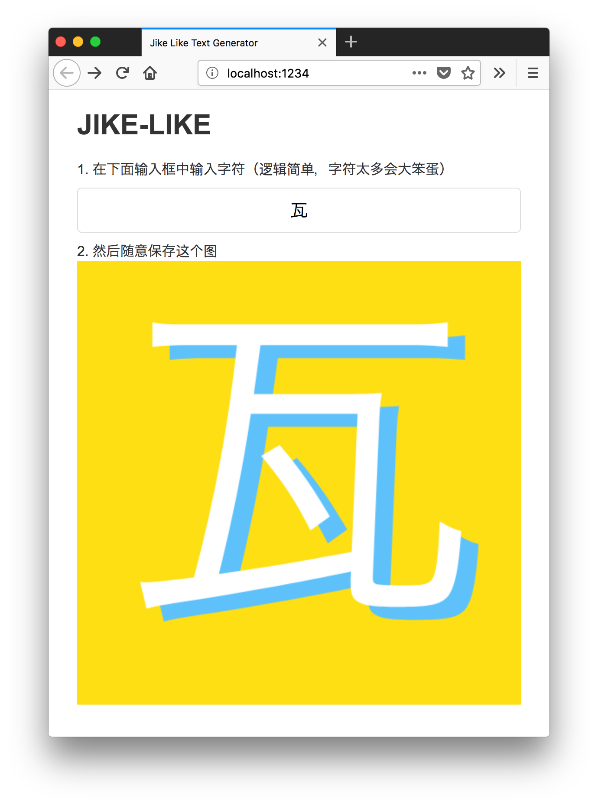

# jike-like
A practicing project to play with Parcel

### What's this

Basic idea is to generate a simple image just like [即刻](https://okjike.com)'s icon.

### How to hack

1. clone this repo of course, `cd` to `src` dir
2. `yarn install`
3. `parcel index.html`

